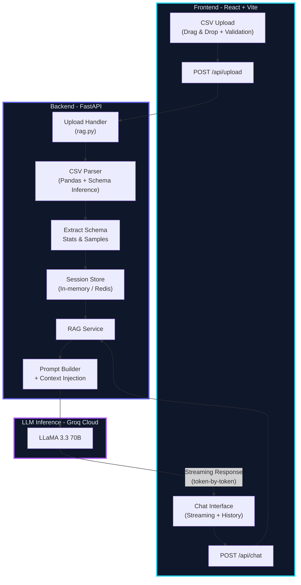

# CSV Analyst AI

An AI-powered data analyst that lets you upload CSV files and chat with your data in real-time. Built with RAG (Retrieval-Augmented Generation) — no vector database needed.


---

## Features

- **Drag & drop CSV upload** with instant parsing
- **Real-time streaming** AI responses (token-by-token)
- **RAG without a vector DB** — CSV context injected directly into the prompt
- **Markdown rendering** for formatted AI responses (tables, code blocks, lists)
- **Session-based** architecture with in-memory storage
- **Responsive UI** with glassmorphism design and mobile sidebar

## Tech Stack

| Layer | Technology |
|-------|-----------|
| **Backend** | FastAPI, Python 3.12+ |
| **LLM** | Groq (LLaMA 3.3 70B Versatile) |
| **RAG** | Pandas — schema extraction + context injection |
| **Frontend** | React 19, Vite 8, Vanilla CSS |

## Project Structure

```
csv-analyst/
├── backend/
│   ├── main.py             # FastAPI app — upload + chat endpoints
│   ├── rag.py              # CSV → structured context builder
│   ├── requirements.txt
│   └── .env                # API key (not committed)
│
└── frontend/
    ├── index.html
    └── src/
        ├── App.jsx          # Root — screen transitions
        ├── Upload.jsx       # File upload with skeleton loader
        ├── Chat.jsx         # Chat interface with sidebar
        ├── MarkdownRenderer.jsx  # Lightweight MD → JSX
        └── index.css        # Full design system
```

## Getting Started

### Prerequisites

- Python 3.12+
- Node.js 18+
- [Groq API key](https://console.groq.com/)

### 1. Backend

```bash
cd csv-analyst/backend
pip install -r requirements.txt
```

Create a `.env` file:

```env
GROQ_API_KEY=your-api-key-here
```

Start the server:

```bash
uvicorn main:app --reload --port 8000
```

### 2. Frontend

```bash
cd csv-analyst/frontend
npm install
npm run dev
```

Open **http://localhost:5173** in your browser.

## How It Works

1. **Upload** — User uploads a CSV file via the frontend
2. **Parse** — Backend reads the CSV with Pandas and extracts:
   - Dataset shape (rows × columns)
   - Column schema (name, dtype, null count)
   - Numeric summary statistics
   - Top categorical values
   - First 20 sample rows
3. **Store** — The structured context is stored in-memory under a session ID
4. **Chat** — User asks questions → context is injected into the LLM prompt → response streams back token-by-token

### Architecture



## API Endpoints

| Method | Endpoint | Description |
|--------|----------|-------------|
| `POST` | `/upload` | Upload a CSV file, returns `session_id` |
| `POST` | `/chat` | Send a message, returns streaming text response |

## License

MIT
